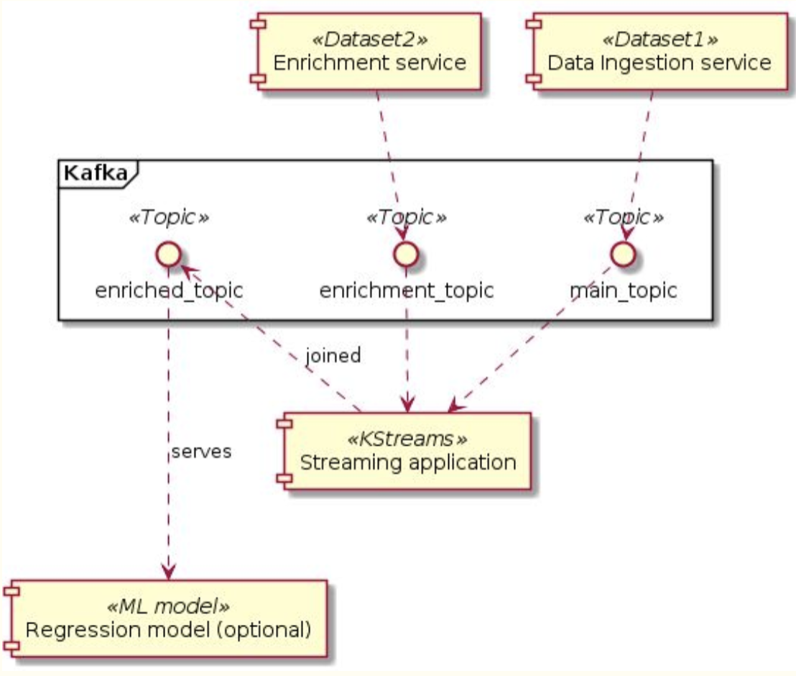

# S𝘤à𝑙ẫ streaming programming final pr💡ject
[](https://travis-ci.org/AlexanderOnbysh/streaming-programming-project)
[]()
[]()
[]()

This is a final project of Streaming programming with Scala at UCU. The aim of this project is to develop services for streaming data to Kafka topics then combine them using Kafka stream join.

## Idea 💡
The idea of the project is to get real stream of tweets and stock prices for given stock symbols, join them by symbol and forward to another Kafka topic for future processing.

Diagram shows rough architecture:  


## ℙroject 𝕊tructure
**twitter-service** - services gets real time stream of tweets with given keywords, all messages go to kafka `tweets` topic.  
**stocks-service** - services gets real time stocks prices from [IEX](https://iexcloud.io/) by given stock symbols, all prices go to kafka `stocks` topic.   
**combiner-service** - service pulls messages from `tweets` and `stocks`, join them by stock symbol and sends to `enriched` topic.  

## Setup local Kafka cluster ⩻⩼ 

This command will start `zookeeper` and `kafka` clusters. Default port is `9092`.  
```bash
make kafka-start
```

Shut down cluster:  
```bash
make kafka-stop
```

## Setup services 🛰
1. Create `stocks-credentials.env`
```bash
TOKEN=sk_0000000000000000000000000
```
Token should be requested from [IEX](https://iexcloud.io/)

2. Create `twitter-credentials.env`
```bash
ACCESS_TOKEN_SECRET=
ACCESS_TOKEN=
CONSUMER_SECRET=
CONSUMER_KEY=
```
Credentials should be requested from [Twitter Developer](https://developer.twitter.com/)

3. Create topics in Kafka
```bash
make kafka-create-topics
```

4. Run services
```bash
make services-start

# to stop
make services-stop
```

## View messages in Kafka topics 📬
1. Install `kaf` tool [github](https://github.com/birdayz/kaf)
```bash
make install-kaf
```

3. View topics
```bash
kaf topics
```

2. View topic's messages
```bash
kaf consume tweets
kaf consume stocks
kaf consume combined
```

## Build images 📦
All images are build automatically from master branch by DockerHub:  
- `alexanderonbysh/twitter-service:latest`
- `alexanderonbysh/stocks-service:latest`
- `alexanderonbysh/combiner-service:latest`

If you want to update code just rebuild docker image:  
```bash
cd twitter-service
docker build -t twitter-service .
``` 

## Notes 📝

### What could be improved 🚀
- move data object like `Tweet`, `Price`, `EnrichedTweet` to common package 🙊
- handle rate limits for Tweeter and IEX API endpoints 🙉
- Tests 🙈
